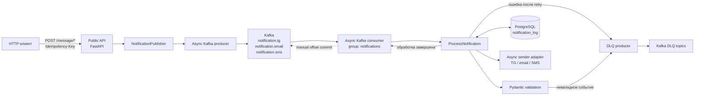
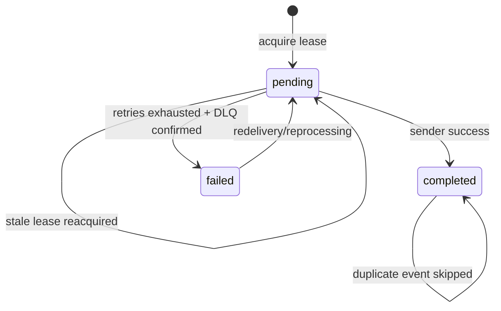

# Notification Service

Асинхронный event-driven сервис отправки уведомлений. Public API принимает HTTP-запрос, формирует идемпотентное событие и публикует его в Kafka. Отдельный worker читает события, валидирует их, защищает обработку lease-механизмом в PostgreSQL и вызывает адаптер нужного канала: Telegram, email или SMS.

> Сейчас адаптеры отправки являются заглушками: они не обращаются к реальным внешним провайдерам, а только имитируют временные ошибки. Проект демонстрирует взаимодействие API, Kafka, worker и PostgreSQL, а также обработку повторов, DLQ и сбоев.

## Содержание

- [Возможности](#возможности)
- [Технологии](#технологии)
- [Архитектура](#архитектура)
- [Как проходит обработка события](#как-проходит-обработка-события)
- [Структура проекта](#структура-проекта)
- [API](#api)
- [Формат Kafka-события](#формат-kafka-события)
- [Kafka topics](#kafka-topics)
- [Модель данных PostgreSQL](#модель-данных-postgresql)
- [Быстрый запуск через Docker Compose](#быстрый-запуск-через-docker-compose)
- [Локальный запуск приложений](#локальный-запуск-приложений)
- [Конфигурация](#конфигурация)
- [Миграции](#миграции)
- [Тестирование и проверки](#тестирование-и-проверки)
- [Надёжность и гарантии доставки](#надёжность-и-гарантии-доставки)
- [Подключение реальных провайдеров](#подключение-реальных-провайдеров)

## Возможности

- полностью асинхронные HTTP API, Kafka producer/consumer и PostgreSQL-доступ;
- ручной commit Kafka offset только после завершения обработки;
- обязательный HTTP-заголовок `Idempotency-Key`;
- стабильный `event_id` для повторного запроса;
- идемпотентный Kafka producer с `acks=all`;
- строгая валидация входных HTTP- и Kafka-событий;
- ограниченные по количеству и времени повторы отправки;
- отдельные DLQ для ошибок каналов;
- poison DLQ для невалидных Kafka-сообщений;
- lease-механизм для восстановления зависших записей `PENDING`;
- readiness- и liveness-проверки API;
- автоматические миграции Alembic при старте worker;
- автоматический перезапуск контейнеров приложения после сбоя.

## Технологии

| Компонент | Технология |
|---|---|
| Язык | Python 3.12 |
| HTTP API | FastAPI, Uvicorn |
| Валидация | Pydantic, pydantic-settings |
| Брокер сообщений | Apache Kafka 3.9.1 |
| Kafka-клиент | `confluent-kafka` 2.14.2, нативные `AIOProducer` и `AIOConsumer` |
| База данных | PostgreSQL 15 |
| ORM и драйвер | SQLAlchemy 2, asyncpg |
| Миграции | Alembic |
| Повторы | Tenacity |
| Инфраструктура | Docker Compose |
| Тесты | `unittest`, `IsolatedAsyncioTestCase` |

## Архитектура



Public API и worker являются независимыми процессами:

- API не отправляет уведомление самостоятельно и не зависит от PostgreSQL;
- Kafka отделяет приём запроса от фоновой обработки;
- worker хранит состояние обработки в PostgreSQL;
- ошибки внешнего канала не блокируют HTTP-запрос, уже принятый API;
- Kafka offset подтверждается только после успешной отправки либо подтверждённой публикации ошибки в DLQ.

## Как проходит обработка события

### Успешный сценарий

1. Клиент отправляет запрос в Public API с `Idempotency-Key`.
2. API проверяет тело запроса и допустимость канала для выбранного типа поздравления.
3. Из типа события и ключа идемпотентности вычисляется стабильный UUID `event_id`.
4. Событие публикуется в `notification.<channel>`.
5. Worker получает событие, но пока не подтверждает Kafka offset.
6. Pydantic проверяет схему, тип события, канал и временную зону `created_at`.
7. Worker атомарно получает lease на `event_id` в таблице `notification_log`.
8. Вызывается адаптер нужного канала с тем же `event_id` в качестве `idempotency_key`.
9. Запись переводится в статус `completed`.
10. Worker вручную подтверждает Kafka offset.

### Временная ошибка провайдера

1. Отправка повторяется ограниченное количество раз.
2. Каждый вызов sender ограничен отдельным таймаутом.
3. Между попытками используется exponential backoff.
4. После исчерпания попыток событие публикуется в `notification.<channel>.dlq`.
5. Только после подтверждения доставки в DLQ запись переводится в `failed`, а Kafka offset подтверждается.
6. Если публикация в DLQ не удалась, исключение поднимается выше и исходный offset не подтверждается.

### Невалидное Kafka-сообщение

Невалидный JSON, неправильная схема, отсутствующий ключ, несовпадение `event_id`, topic или канала приводят к публикации сообщения в `notification.invalid.dlq`. Offset исходного сообщения подтверждается только после подтверждённой записи в poison DLQ.

### Аварийное завершение worker

Если worker завершился после создания `PENDING`, но до финального статуса:

1. Kafka повторно доставит неподтверждённое событие;
2. новый worker дождётся окончания текущего lease;
3. просроченный `PENDING` будет атомарно захвачен повторно;
4. обработка продолжится без вечной блокировки события.

## Структура проекта

```text
Notification-Service/
├── README.md
├── docker-compose.yml
├── .dockerignore
├── public_api/
│   ├── Dockerfile
│   ├── requirements.txt
│   ├── .env.example
│   └── src/public_api/
│       ├── main.py
│       ├── api/
│       │   ├── routes.py
│       │   └── schemas.py
│       ├── core/
│       │   ├── config.py
│       │   └── logger.py
│       ├── infrastructure/
│       │   ├── dependencies.py
│       │   └── kafka/
│       │       ├── producer.py
│       │       └── topics.py
│       └── use_cases/
│           └── publish_notification.py
├── notification_service/
│   ├── Dockerfile
│   ├── requirements.txt
│   ├── .env.example
│   ├── alembic.ini
│   ├── alembic/
│   │   ├── env.py
│   │   ├── script.py.mako
│   │   └── versions/
│   │       ├── 20260730_0001_create_notification_log.py
│   │       └── 20260730_0002_add_processing_lease.py
│   └── src/notification_service/
│       ├── worker.py
│       ├── core/
│       │   ├── config.py
│       │   └── logger.py
│       ├── domain/
│       │   ├── events.py
│       │   └── exceptions.py
│       ├── infrastructure/
│       │   ├── db/
│       │   │   ├── models.py
│       │   │   ├── repositories.py
│       │   │   └── session.py
│       │   └── kafka/
│       │       ├── consumer.py
│       │       ├── producer.py
│       │       └── topics.py
│       ├── senders/
│       │   └── async_sender.py
│       └── use_cases/
│           └── process_notification.py
└── tests/
    └── test_async_contracts.py
```

Файлы `__init__.py`, отмечающие Python-пакеты, в дереве не показаны.

### Корневые файлы

| Путь | Назначение |
|---|---|
| `README.md` | Документация проекта |
| `docker-compose.yml` | PostgreSQL, Kafka, Public API, worker, healthchecks, зависимости и volumes |
| `.dockerignore` | Исключает Git, IDE, виртуальные окружения, кэш и локальные `.env` из build context |
| `tests/test_async_contracts.py` | Асинхронные contract- и reliability-тесты без реальных Kafka и PostgreSQL |

### Public API

| Путь | Назначение |
|---|---|
| `public_api/Dockerfile` | Образ Public API на Python 3.12 |
| `public_api/requirements.txt` | Зависимости API |
| `public_api/.env.example` | Пример локальной Kafka-конфигурации API |
| `public_api/src/public_api/main.py` | FastAPI application, lifespan producer, `/health` и `/live` |
| `public_api/src/public_api/api/routes.py` | HTTP endpoints и обязательный `Idempotency-Key` |
| `public_api/src/public_api/api/schemas.py` | Pydantic-схема запроса и перечисление каналов |
| `public_api/src/public_api/core/config.py` | Настройки приложения и Kafka producer |
| `public_api/src/public_api/core/logger.py` | Единый формат логирования |
| `public_api/src/public_api/infrastructure/dependencies.py` | FastAPI dependency injection для общего Kafka producer |
| `public_api/src/public_api/infrastructure/kafka/producer.py` | Асинхронная публикация с ожиданием delivery result |
| `public_api/src/public_api/infrastructure/kafka/topics.py` | Формирование имени `notification.<channel>` |
| `public_api/src/public_api/use_cases/publish_notification.py` | Проверка бизнес-ограничений, формирование события и стабильного `event_id` |

### Notification worker

| Путь | Назначение |
|---|---|
| `notification_service/Dockerfile` | Образ worker и Alembic |
| `notification_service/requirements.txt` | Зависимости worker |
| `notification_service/.env.example` | Пример локальной конфигурации PostgreSQL, Kafka и retry |
| `notification_service/alembic.ini` | Конфигурация Alembic |
| `notification_service/alembic/env.py` | Асинхронное окружение миграций |
| `notification_service/alembic/versions/` | Версионированные изменения схемы PostgreSQL |
| `notification_service/src/notification_service/worker.py` | Главный цикл consumer → process → commit и корректное закрытие ресурсов |
| `notification_service/src/notification_service/core/config.py` | Kafka, DB, lease, timeout и retry-настройки с проверкой их согласованности |
| `notification_service/src/notification_service/core/logger.py` | Настройка логирования worker |
| `notification_service/src/notification_service/domain/events.py` | Строгий контракт Kafka-события |
| `notification_service/src/notification_service/domain/exceptions.py` | Доменные ошибки sender и неизвестного topic |
| `notification_service/src/notification_service/infrastructure/db/models.py` | `NotificationLog` и статусы обработки |
| `notification_service/src/notification_service/infrastructure/db/repositories.py` | Атомарный lease, повторный захват и обновление статуса |
| `notification_service/src/notification_service/infrastructure/db/session.py` | Async SQLAlchemy engine и фабрика сессий |
| `notification_service/src/notification_service/infrastructure/kafka/consumer.py` | Асинхронное чтение, декодирование, poison-envelope и ручной commit |
| `notification_service/src/notification_service/infrastructure/kafka/producer.py` | Подтверждённая асинхронная публикация в DLQ |
| `notification_service/src/notification_service/infrastructure/kafka/topics.py` | Список входных notification topics |
| `notification_service/src/notification_service/senders/async_sender.py` | Заглушки email/SMS/Telegram sender |
| `notification_service/src/notification_service/use_cases/process_notification.py` | Валидация, lease, retry, sender, DLQ и финальный статус |

## API

После запуска:

- Swagger UI: [http://localhost:8001/docs](http://localhost:8001/docs)
- ReDoc: [http://localhost:8001/redoc](http://localhost:8001/redoc)
- liveness: [http://localhost:8001/live](http://localhost:8001/live)
- readiness: [http://localhost:8001/health](http://localhost:8001/health)

### `POST /message/birthday`

Поздравление с днём рождения:

- разрешены `tg` и `sms`;
- `email` возвращает `400 Bad Request`.

```bash
curl -X POST http://localhost:8001/message/birthday \
  -H "Content-Type: application/json" \
  -H "Idempotency-Key: birthday-user-42-2026" \
  -d '{
    "msg_type": "tg",
    "msg_text": "Поздравляем с днём рождения!"
  }'
```

### `POST /message/christmas`

Рождественское поздравление:

- разрешены `tg` и `email`;
- `sms` возвращает `400 Bad Request`.

```bash
curl -X POST http://localhost:8001/message/christmas \
  -H "Content-Type: application/json" \
  -H "Idempotency-Key: christmas-user-42-2026" \
  -d '{
    "msg_type": "email",
    "msg_text": "Поздравляем с Рождеством!"
  }'
```

Успешный ответ имеет статус `202 Accepted`:

```json
{
  "status": "accepted",
  "event_id": "bb266a9f-8d42-52aa-832c-77ef353479dd"
}
```

`event_id` детерминирован по типу события и `Idempotency-Key`. Повтор одного endpoint с тем же ключом вернёт тот же идентификатор. Для новой логической операции используйте новый ключ.

### Схема HTTP-запроса

| Поле | Тип | Ограничения |
|---|---|---|
| `msg_type` | `tg`, `email` или `sms` | Допустимость зависит от endpoint |
| `msg_text` | string | От 10 до 400 символов |
| `Idempotency-Key` | HTTP header | Обязательный, от 8 до 128 символов |

### Health endpoints

| Endpoint | Назначение | Ответ |
|---|---|---|
| `GET /live` | Проверяет, что процесс API работает | `200 {"status":"ok"}` |
| `GET /health` | Проверяет доступность Kafka через общий producer | `200`, либо `503` при недоступной Kafka |

## Формат Kafka-события

```json
{
  "event_id": "bb266a9f-8d42-52aa-832c-77ef353479dd",
  "event_type": "birthday",
  "channel": "tg",
  "msg_text": "Поздравляем с днём рождения!",
  "created_at": "2026-07-30T15:00:00+00:00"
}
```

| Поле | Назначение |
|---|---|
| `event_id` | Идентификатор и ключ Kafka-сообщения |
| `event_type` | `birthday` или `christmas` |
| `channel` | `tg`, `email` или `sms` |
| `msg_text` | Текст длиной 10–400 символов |
| `created_at` | Время создания с обязательной временной зоной |

Worker дополнительно проверяет:

- совпадение Kafka key и `payload.event_id`;
- соответствие topic значению `payload.channel`;
- отсутствие неизвестных полей;
- корректность всех типов и ограничений.

## Kafka topics

Основные topics:

| Topic | Назначение |
|---|---|
| `notification.tg` | Telegram-уведомления |
| `notification.email` | Email-уведомления |
| `notification.sms` | SMS-уведомления |

DLQ topics:

| Topic | Назначение |
|---|---|
| `notification.tg.dlq` | Ошибки Telegram после исчерпания retry |
| `notification.email.dlq` | Ошибки email после исчерпания retry |
| `notification.sms.dlq` | Ошибки SMS после исчерпания retry |
| `notification.invalid.dlq` | Невалидный JSON, схема, key, topic или channel |

Consumer group worker: `notifications`.

В compose-конфигурации topics создаются Kafka автоматически при первой публикации. Если в вашем окружении `auto.create.topics.enable=false`, создайте основные и DLQ topics заранее.

## Модель данных PostgreSQL

Таблица `notification_log`:

| Колонка | Тип | Назначение |
|---|---|---|
| `event_id` | `VARCHAR`, PK | Идентификатор события и ключ дедупликации |
| `status` | enum | `pending`, `completed` или `failed` |
| `updated_at` | `TIMESTAMPTZ` | Время последнего обновления |
| `locked_until` | `TIMESTAMPTZ`, nullable | Срок действия processing lease |
| `attempt_count` | integer | Количество захватов события для обработки |
| `last_error` | text, nullable | Последняя ожидаемая ошибка отправки |

Состояния:



## Быстрый запуск через Docker Compose

### Требования

- Docker Engine или Docker Desktop;
- Docker Compose v2;
- свободные порты `8001`, `5433` и `9094`.

Проверка:

```bash
docker --version
docker compose version
```

### Запуск

Из корня проекта:

```bash
docker compose up --build -d
```

При старте будут подняты:

| Сервис | Внутренний адрес | Адрес с host |
|---|---|---|
| Public API | `public_api:8001` | `http://localhost:8001` |
| Kafka | `kafka:9092` | `localhost:9094` |
| PostgreSQL | `notification_db:5432` | `localhost:5433` |
| Notification worker | отдельный процесс без HTTP-порта | — |

Worker сначала выполнит:

```bash
python -m alembic upgrade head
```

и только после успешной миграции запустит consumer.

### Проверка состояния

```bash
docker compose ps
docker compose logs -f public_api notification_service
curl http://localhost:8001/live
curl http://localhost:8001/health
```

Полезные команды:

```bash
# Пересобрать и перезапустить приложения
docker compose up --build -d public_api notification_service

# Перезапустить API после изменения исходного кода
docker compose restart public_api

# Посмотреть логи Kafka
docker compose logs -f kafka

# Остановить проект, сохранив данные PostgreSQL
docker compose down
```

Удаление volume PostgreSQL необратимо удалит локальные данные проекта:

```bash
docker compose down -v
```

### Переменные Docker Compose

Compose содержит безопасные только для локальной разработки значения по умолчанию. Их можно переопределить через переменные shell или корневой файл `.env`:

```dotenv
DB_USER=user
DB_PASS=change-me
DB_NAME=notification_db
KAFKA_DELIVERY_TIMEOUT_MS=10000
KAFKA_MAX_POLL_INTERVAL_MS=180000
PROCESSING_LEASE_SECONDS=60
SENDER_MAX_ATTEMPTS=3
SENDER_ATTEMPT_TIMEOUT_SECONDS=10
SENDER_RETRY_MIN_SECONDS=1
SENDER_RETRY_MAX_SECONDS=5
```

Не используйте значения по умолчанию для production. Не добавляйте реальные секреты в Git.

Проверить итоговую compose-конфигурацию без запуска:

```bash
docker compose config
```

## Локальный запуск приложений

Для локального запуска нужны доступные PostgreSQL и Kafka. Их можно установить отдельно либо поднять только инфраструктуру:

```bash
docker compose up -d notification_db kafka
```

В этом варианте приложения подключаются к:

- PostgreSQL: `localhost:5433`;
- Kafka: `localhost:9094`.

### 1. Создание виртуального окружения

Из корня проекта:

```bash
python -m venv .venv
```

Активация в Linux/macOS:

```bash
source .venv/bin/activate
```

Активация в PowerShell:

```powershell
.\.venv\Scripts\Activate.ps1
```

Установка зависимостей обоих приложений:

```bash
python -m pip install --upgrade pip
python -m pip install -r notification_service/requirements.txt
python -m pip install -r public_api/requirements.txt
```

### 2. Настройка worker

Скопируйте пример:

```bash
cp notification_service/.env.example notification_service/.env
```

PowerShell:

```powershell
Copy-Item notification_service\.env.example notification_service\.env
```

Для инфраструктуры из Docker Compose измените значения:

```dotenv
DB_HOST=localhost
DB_PORT=5433
KAFKA_BOOTSTRAP_SERVERS=localhost:9094
```

Затем:

```bash
cd notification_service
python -m alembic upgrade head
```

Linux/macOS:

```bash
export PYTHONPATH="$PWD/src"
python -m notification_service.worker
```

PowerShell:

```powershell
$env:PYTHONPATH = "$PWD\src"
python -m notification_service.worker
```

### 3. Настройка Public API

В другом терминале из корня проекта:

```bash
cp public_api/.env.example public_api/.env
```

PowerShell:

```powershell
Copy-Item public_api\.env.example public_api\.env
```

Укажите:

```dotenv
KAFKA_BOOTSTRAP_SERVERS=localhost:9094
KAFKA_DELIVERY_TIMEOUT_MS=10000
```

Linux/macOS:

```bash
cd public_api
export PYTHONPATH="$PWD/src"
uvicorn public_api.main:app --host 0.0.0.0 --port 8001
```

PowerShell:

```powershell
Set-Location public_api
$env:PYTHONPATH = "$PWD\src"
uvicorn public_api.main:app --host 0.0.0.0 --port 8001
```

## Конфигурация

### Public API

| Переменная | По умолчанию | Назначение |
|---|---:|---|
| `APP_NAME` | `Public API` | Название приложения |
| `APP_HOST` | `0.0.0.0` | Настройка приложения |
| `APP_PORT` | `8001` | Настройка приложения |
| `KAFKA_BOOTSTRAP_SERVERS` | `kafka:9092` | Kafka bootstrap servers |
| `KAFKA_DELIVERY_TIMEOUT_MS` | `10000` | Предельное время подтверждения публикации |

`APP_HOST` и `APP_PORT` не передаются в Uvicorn автоматически: фактические host и port задаются аргументами команды запуска в Docker Compose или терминале.

### Notification worker

| Переменная | По умолчанию | Назначение |
|---|---:|---|
| `DB_HOST` | обязательна | PostgreSQL host |
| `DB_PORT` | обязательна | PostgreSQL port |
| `DB_USER` | обязательна | PostgreSQL user |
| `DB_PASS` | обязательна | PostgreSQL password |
| `DB_NAME` | обязательна | PostgreSQL database |
| `KAFKA_BOOTSTRAP_SERVERS` | `kafka:9092` | Kafka bootstrap servers |
| `KAFKA_DELIVERY_TIMEOUT_MS` | `10000` | Таймаут доставки события в DLQ |
| `KAFKA_MAX_POLL_INTERVAL_MS` | `180000` | Максимальный интервал между poll |
| `PROCESSING_LEASE_SECONDS` | `60` | Срок действия lease |
| `SENDER_MAX_ATTEMPTS` | `3` | Максимальное число попыток sender |
| `SENDER_ATTEMPT_TIMEOUT_SECONDS` | `10` | Таймаут одной попытки |
| `SENDER_RETRY_MIN_SECONDS` | `1` | Минимальная задержка backoff |
| `SENDER_RETRY_MAX_SECONDS` | `5` | Максимальная задержка backoff |

Настройки worker проверяются при старте:

- `SENDER_RETRY_MIN_SECONDS` не может превышать `SENDER_RETRY_MAX_SECONDS`;
- lease должен покрывать все sender attempts, задержки и публикацию в DLQ;
- `KAFKA_MAX_POLL_INTERVAL_MS` должен быть больше processing lease.

Некорректная комбинация завершит приложение при старте, предотвращая работу с опасными параметрами.

## Миграции

Показать текущую версию в работающем контейнере:

```bash
docker compose exec notification_service python -m alembic current
```

Применить все миграции:

```bash
docker compose exec notification_service python -m alembic upgrade head
```

Посмотреть историю:

```bash
docker compose exec notification_service python -m alembic history
```

Локально команды запускаются из `notification_service/`:

```bash
python -m alembic upgrade head
python -m alembic current
python -m alembic history
```

Сгенерировать SQL без подключения к БД:

```bash
python -m alembic upgrade head --sql
```

Откат миграций может удалить колонки или таблицы. Перед downgrade сделайте резервную копию БД.

## Тестирование и проверки

Тесты используют стандартный `unittest`, подменяют Kafka и DB boundary объектами и не требуют запущенных контейнеров:

```bash
python -m unittest discover -s tests -v
```

Проверяемые сценарии включают:

- асинхронность публичных интерфейсов;
- повторное использование и закрытие API producer;
- асинхронный consumer и ручной commit;
- ошибку Kafka commit;
- закрытие consumer при ошибке subscribe;
- ограниченный sender retry;
- подтверждённую публикацию в channel DLQ;
- poison DLQ;
- восстановление занятого lease;
- стабильный API `event_id`;
- отсутствие commit при неожиданной программной ошибке sender.

Дополнительные проверки:

```bash
python -m compileall -q notification_service/src public_api/src tests
python -m pip check
```

Полный интеграционный тест требует реальных Kafka и PostgreSQL:

1. поднять compose;
2. дождаться healthy-состояния Kafka, PostgreSQL и API;
3. отправить запрос с уникальным `Idempotency-Key`;
4. проверить логи worker;
5. проверить `notification_log` и соответствующий Kafka topic/DLQ.

Пример проверки таблицы:

```bash
docker compose exec notification_db \
  psql -U user -d notification_db \
  -c "SELECT event_id, status, attempt_count, last_error FROM notification_log;"
```

## Надёжность и гарантии доставки

### Что гарантирует проект

- Kafka producer ожидает delivery result и не считает вызов успешным сразу после помещения сообщения в локальный буфер.
- Producer использует `acks=all` и `enable.idempotence=true`.
- Автоматический commit и автоматическое сохранение offset consumer отключены.
- Offset подтверждается после `completed` либо после подтверждённой публикации в DLQ и записи `failed`.
- Неудачный Kafka commit считается ошибкой и приводит к перезапуску worker.
- Просроченный `PENDING` можно обработать повторно.
- Уже завершённый `event_id` пропускается.
- Неожиданные программные ошибки поднимаются до worker и не превращаются в `failed` с commit.

### Семантика доставки

Между Kafka и worker используется модель **at-least-once**. Повторная доставка возможна, например если процесс завершился после внешней отправки, но до обновления PostgreSQL или commit Kafka offset.

Для ограничения дублей:

- API формирует стабильный `event_id`;
- все события одного запроса используют этот идентификатор как Kafka key;
- PostgreSQL хранит финальный статус по `event_id`;
- sender получает `event_id` как `idempotency_key`.

Реальный внешний провайдер должен поддерживать идемпотентность по этому ключу либо проекту потребуется собственный transactional outbox/provider-delivery журнал. Абсолютная exactly-once доставка внешнего побочного эффекта без участия провайдера не гарантируется.

### DLQ

Публикация в DLQ является частью обработки, а не fire-and-forget операцией. При недоступной Kafka исходный offset останется неподтверждённым и событие будет получено снова.

Проект публикует сообщения в DLQ, но не содержит отдельного DLQ consumer. Повторная обработка, алерты и ручной replay должны быть реализованы отдельным сервисом или эксплуатационной процедурой.

## Подключение реальных провайдеров

Точка расширения:

```text
notification_service/src/notification_service/senders/async_sender.py
```

Каждый метод имеет асинхронный контракт:

```python
async def email_send(msg_data: dict, idempotency_key: str) -> None:
    ...
```

При реализации реального sender:

1. используйте асинхронный SDK или HTTP-клиент;
2. передавайте `idempotency_key` провайдеру, если он поддерживается;
3. не добавляйте бесконечные retry внутри адаптера;
4. преобразуйте только ожидаемые временные ошибки в соответствующий доменный exception;
5. не подавляйте ошибки программирования и ошибки конфигурации;
6. не логируйте токены, пароли и полный персональный контент;
7. добавьте contract- и интеграционные тесты;
8. храните секреты во внешнем secret store, а не в репозитории.

После замены заглушек общий pipeline, lease, retry, DLQ и commit-протокол менять не требуется.
